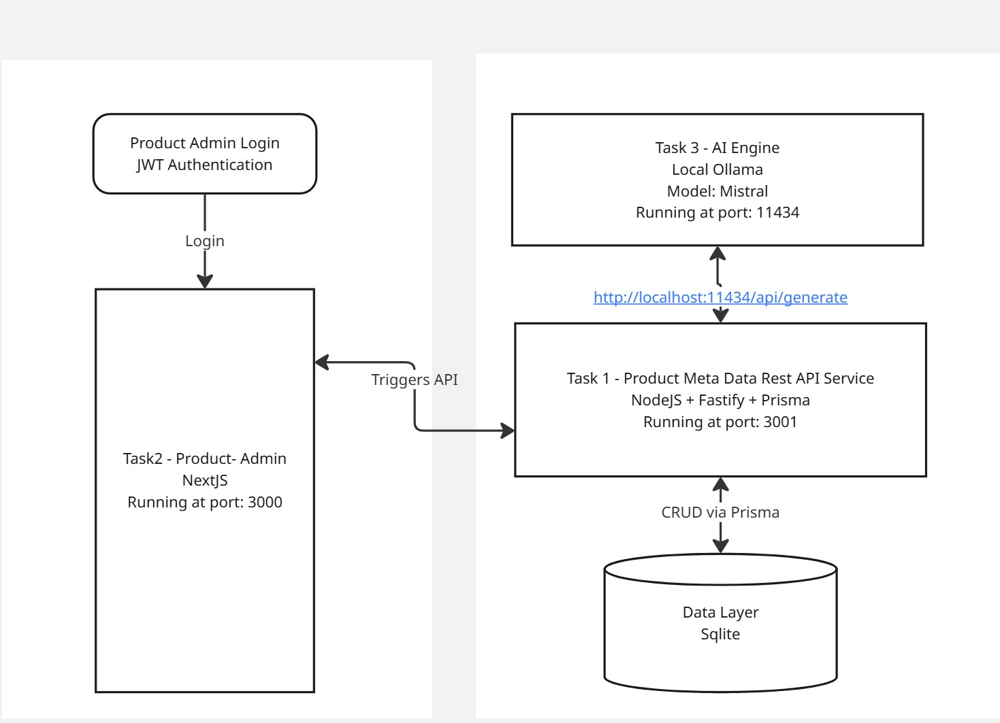

# 🧩 Product Metadata Microservice

A TypeScript-based Fastify microservice that provides full CRUD support for managing product metadata



---

## ✅ Features

- 🚀 Fastify + TypeScript microservice
- 🗂️ Full CRUD for Product entity
- 🔍 Swagger/OpenAPI documentation
- 🧪 Jest test suite (`GET`, `POST`)
- 🗃️ Prisma ORM with SQLite
- 🐳 Docker & Docker Compose support
- 📦 Modular service, controller, and route structure

---

## 🧱 Tech Stack

- **Fastify** — Web framework
- **TypeScript** — Static typing
- **Prisma** — ORM for SQLite
- **Jest** — Testing framework
- **Swagger** — API docs via `@fastify/swagger`
- **Docker** — Containerization

---

## 📦 Setup

### 1. Clone & Install

```bash
git clone git@github.com:varzay-abbas/product-metadata-microservice.git
cd task1-product-service
npm install
```

### 2. Prisma DB Setup

```bash
npx prisma generate
npx prisma migrate dev --name init
```

> DB is SQLite (`prisma/dev.db`)

---

## ▶️ Run Locally

```bash
npm run dev
```

API runs at: `http://localhost:3000`  
Swagger docs: `http://localhost:3000/docs`

---

## ✅ Available Endpoints

| Method | Endpoint        | Description             |
|--------|------------------|-------------------------|
| POST   | /products        | Create a product        |
| GET    | /products/:id    | Get product by ID       |
| PUT    | /products/:id    | Update product          |
| DELETE | /products/:id    | Delete product          |
| GET    | /products        | List all products       |

---

## 🧪 Running Tests

```bash
npm run test
```

> Tests are located in `/test/product.test.ts`  
> Uses `supertest` to simulate HTTP requests.

---

## 🐳 Docker

### Build & Start

```bash
docker-compose up --build
```

### Exposed

- API: `http://localhost:3000`
- Swagger: `http://localhost:3000/docs`

---

## 🧠 Entity: Product

| Field       | Type       | Notes                        |
|-------------|------------|------------------------------|
| id          | UUID       | Auto-generated               |
| name        | string     | Required, max 255 chars      |
| description | string     | Required, max 2000 chars     |
| tags        | string[]   | Optional (JSON array)        |
| price       | number     | Required, positive           |
| createdAt   | timestamp  | Auto-managed                 |
| updatedAt   | timestamp  | Auto-managed                 |

---

## 📁 Folder Structure

```
src/
├── controllers/      # Route handlers
├── routes/           # Fastify routes
├── services/         # Business logic
├── app.ts            # App initialization
├── swagger.ts        # Swagger setup
prisma/
├── schema.prisma     # DB schema
test/
├── product.test.ts   # Jest tests
```

---

## 📝 License

MIT – for interview/demo purposes only.
